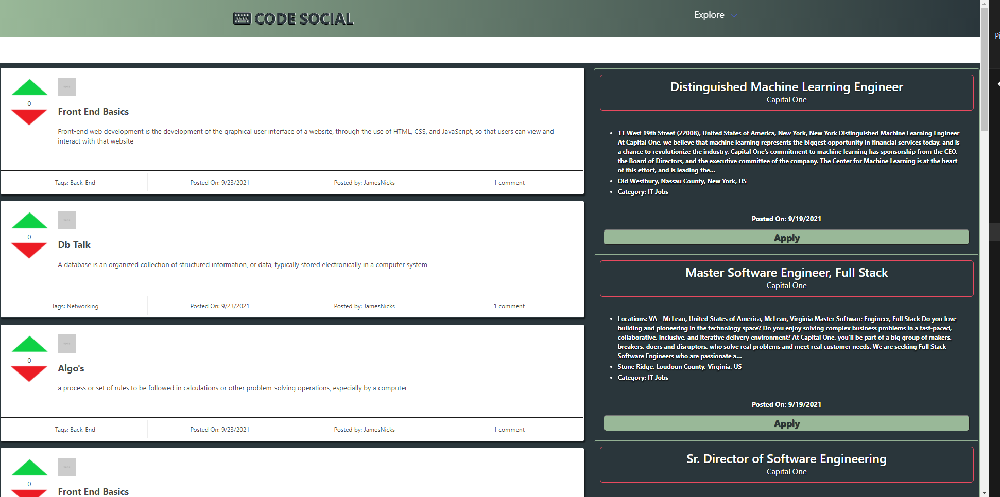
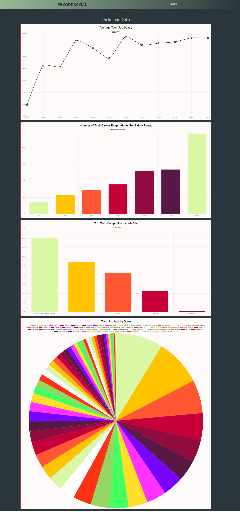
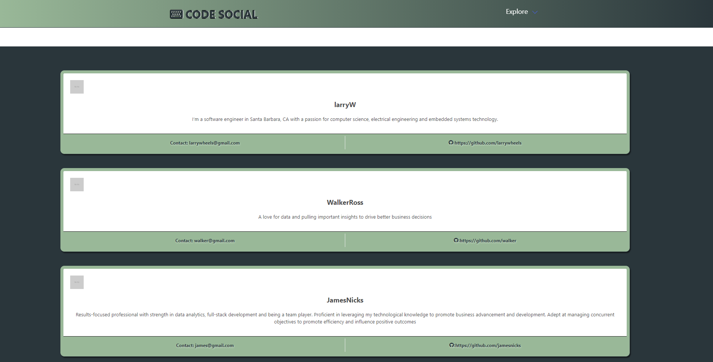
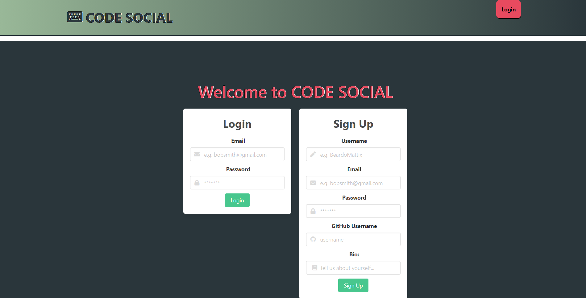

# RWP

## Table of Contents

- [Description](#description-)
- [Licenses](#licenses-)
- [Installation](#installation-)
- [Usage](#usage-)
- [Technologies](#technologies-)
- [Screen shots](#screen-shots-)
- [Credits](#credits-)
- [Contributions](#contributions-)
- [Questions](#questions-)

## Description :

This is a full stack social network application for coders who are new to the industry and looking for work and information about companies and the interview process. The site will allow users to post information in various categories (Company Info, Interview Advice, Practice Code for Interviews), comment on other users posts, update posts, delete posts, and upvote posts.

## Licenses :

[](https://opensource.org/licenses/MIT)

[Click here to see the running RWP!](notyet@heroku.com)

## Installation :

To install the RWP App use the instructions bellow &#8595;

```
 npm install

 mysql -u root -p

 source db/schema.sql

 npm run seed

 npm run start
```

## Usage :

User needs to install the app by running the command `npm install` then user needs to run the command `mysql -u root -p` with the mysql password entered user needs to run the command `source db/schema.sql;` to start the database then the `quit;` command to exit the mysql server after that user needs to create the `.env` file with the username the database name and the password for the environment variables. If user needs to seed the database user can run the command `npm run seeds` lastly user can run the command `npm run start` to start the express server.

## Technologies :

- JavaScript.
- CSS.
- Handlebars.js.
- Node.js.
- Express.js.
- Sequelize.js.
- Mysql.
- Mysql2 npm package.
- Express-session.
- Dotenv.
- Husky.
- Prettier.
- Charts.js.
- Adzuna API.

## Screen shots :

### Here are screen shots of my deployed RWP App!

## Credits :

- [ChaseNicks](https://github.com/ChaseNicks)
- [BeardoMattix](https://github.com/BeardoMattix)
- [ebront08](https://github.com/ebront08)
- [Muiasar-Al-Ani](https://github.com/Muiasar-Al-Ani)

## Contributions :

    Contributions, issues, and feature requests are welcome!
    Give a ⭐️ if you like this project!

## Questions :

If you have any Question please feel free to contact me:

- [ChaseNicks](https://github.com/ChaseNicks)
- [BeardoMattix](https://github.com/BeardoMattix)
- [ebront08](https://github.com/ebront08)
- [Muiasar-Al-Ani](https://github.com/Muiasar-Al-Ani)

&copy; 2021 [RWP](https://github.com/ChaseNicks)
